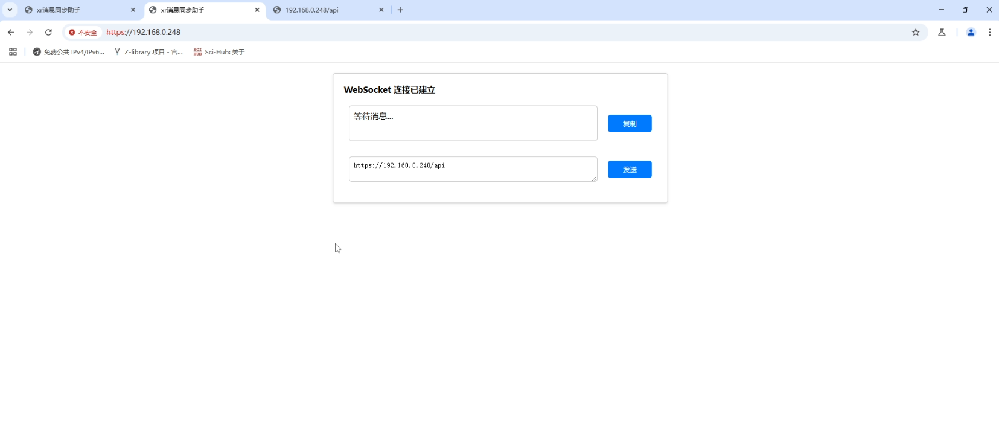
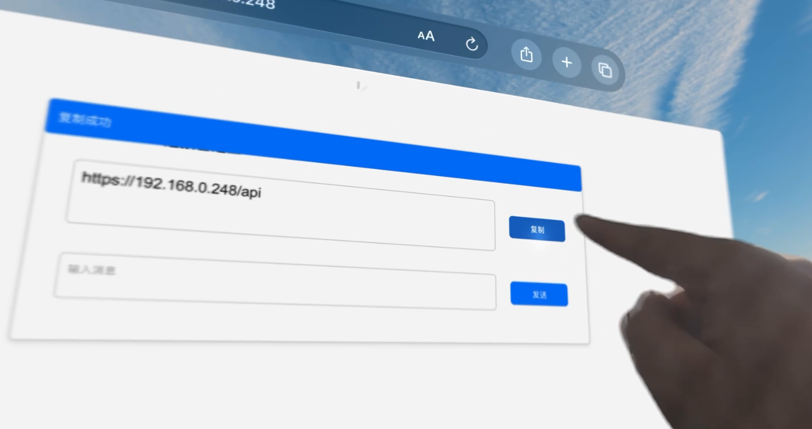
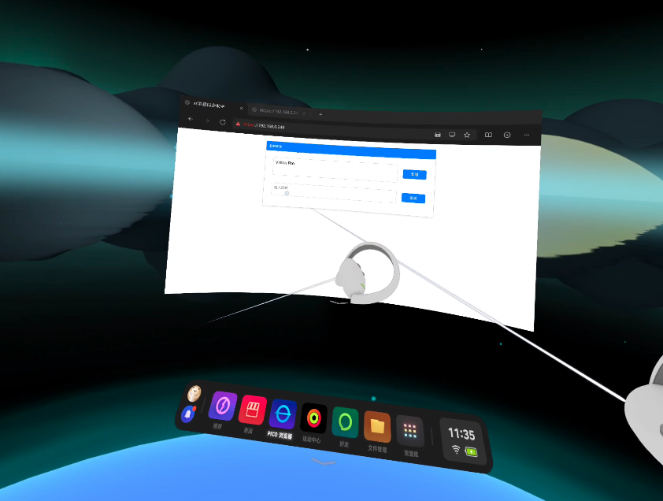

# XRTools Web

XRTools Web 是一个使用 Go 语言编写的 Web 应用程序，支持 WebSocket 连接、消息广播和文件上传功能。

方便不同设备之间的消息同步。比如 Pico / visionPro 和 PC 之间同步消息。mac 和 pc 之间使用也方便，不用别的软件。

* PC 上运行服务端


* PC 浏览器访问发送消息



* visionPro 接收消息并复制到剪贴板



* pico 接受消息并复制到剪贴板




## 功能

- 建立 WebSocket 连接
- 接收和发送消息
- 广播消息给所有连接的客户端
- 复制消息到剪贴板
- 上传文件

## 技术栈

- Go
- WebSocket
- HTML/CSS/JavaScript

## 安装

1. 克隆仓库：

   ```bash
   git clone https://github.com/your-username/xrtools_web.git
   ```

2. 进入项目目录：

   ```bash
   cd xrtools_web
   ```

3. 生成SSL证书和私钥（仅用于开发和测试目的）：

   ```bash
    openssl req -x509 -newkey rsa:4096 -keyout key.pem -out cert.pem -days 365 -nodes
   ```

4. 运行项目：

   ```bash
   go run main.go -port=8443
   ```

## 使用

1. 打开浏览器，访问 https://localhost:8443。

2. 在输入框中输入消息，点击“发送”按钮发送消息。

3. 点击“复制”按钮复制消息到剪贴板

## 命令行参数

- port: 指定服务器监听的端口号，默认为443
